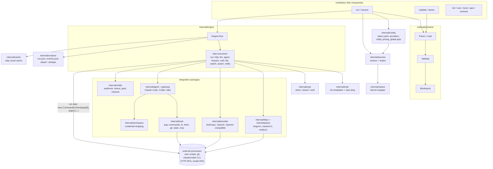
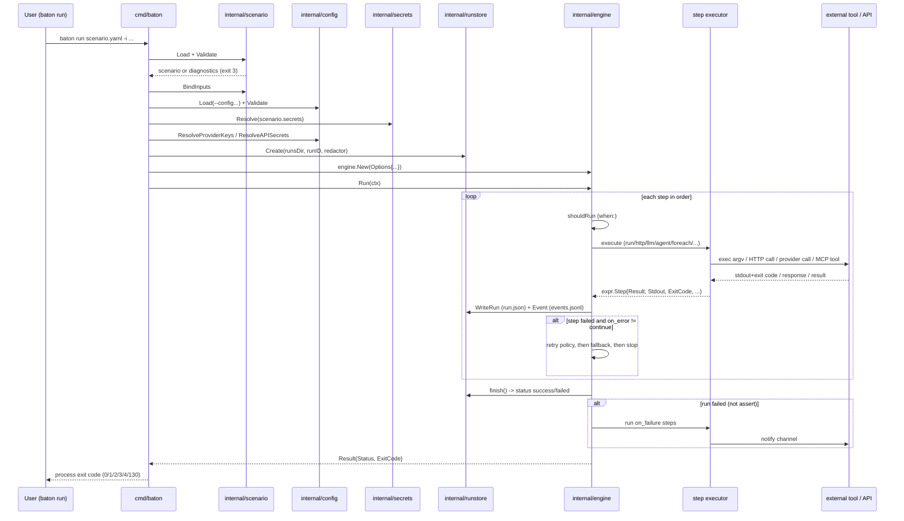

# Architecture

This document maps the specification ([spec.md](spec.md)) onto the actual Go
packages: what calls what, what is persisted where, and where a config value
or a secret is allowed to flow. It is a map for reading the code, not a
replacement for the [overview](overview.md) or the spec — when in doubt, the
code and the spec win.

Everything below describes what `go build ./cmd/baton` actually does today.
Sections that describe something not yet implemented say so explicitly.

## Component map



Notes on the diagram:

- `cmd/baton` holds only CLI parsing and wiring (`cmd/baton/main.go`,
  `run.go`, `validate.go`, `doctor.go`, `resume.go`, `runs.go`, `tools.go`,
  `apis.go`, `init.go`, `schema.go`). No step logic lives there.
- `internal/scenario` never talks to the network or the filesystem beyond
  reading the scenario/schema files; `internal/engine` is the only package
  that executes steps.
- The engine has no FTP or SFTP client, a deliberate scope decision (see
  [No native file-transfer protocol](#no-native-file-transfer-protocol)). A
  `run` step execs one argv command (`exec.CommandContext`, with no shell
  of its own — see [Execution lifecycle](#execution-lifecycle)); moving a
  file to another host is the job of whatever binary or script that command
  points at. There is also no S3 client or output/delivery subsystem in the
  codebase today, but that describes the current state, not a decision to
  keep S3 out permanently.

## Package responsibilities

| Package | Responsibility | Key files |
|---|---|---|
| `cmd/baton` | Flag parsing, command dispatch, process exit codes | `main.go`, `run.go`, `resume.go` |
| `internal/scenario` | YAML parsing (`gopkg.in/yaml.v3`, `KnownFields(true)`), static validation, input binding, JSON Schema of the format | `parse.go`, `validate.go`, `inputs.go`, `schema.go` |
| `internal/config` | Global `baton.yaml`: providers, notify channels, pricing table, global `apis:`, global secrets, MCP servers | `config.go`, `secrets.go` |
| `internal/secrets` | Resolves `env`/`file` secret sources into `values.Secret`, builds the redactor | `resolve.go`, `redact.go` |
| `internal/values` | `Secret` wrapper type that never prints its value via `%v`/`String()`/`MarshalJSON` | `secret.go` |
| `internal/engine` | Runs one scenario: step dispatch, retries, `on_error`/`on_failure`, budgets, template/expr context, cost ledger | `engine.go`, `run.go`, `http.go`, `llm.go`, `agent.go`, `foreach.go`, `file.go`, `cost.go` |
| `internal/tmpl` | Go `text/template` rendering with the scenario's function set (`render`, `md2html`, ...) | `tmpl.go`, `markdown.go` |
| `internal/expr` | Compiles/evaluates `when:`, `assert:`, `until.until` (expr-lang) | `expr.go` |
| `internal/httpx` | Executes raw and pack-defined HTTP operations: auth schemes, pagination, gojq transforms | `httpx.go`, `op.go`, `exchange.go` |
| `internal/packs` | Loads YAML packs (local dir or pinned git ref), checksums them, matches `forge/v1`/`tracker/v1`/`notify/v1` | `load.go`, `source.go`, `implements.go` |
| `internal/ifaces` | The interface registry (`forge/v1`, `tracker/v1`, `notify/v1`) a pack can claim to implement | `ifaces.go` |
| `internal/provider` | Model backends: Anthropic, OpenAI, any OpenAI-compatible endpoint (OpenRouter included), structured output | `anthropic.go`, `openai.go`, `compat.go`, `structured.go` |
| `internal/agent` | The `Engine` interface an `agent` step drives, and the tool `Policy` a profile resolves to | `engine.go`, `policy.go` |
| `internal/agent/claudecode`, `internal/agent/codex`, `internal/agent/fake` | Concrete agent engines | one package per engine |
| `internal/gateway` | Per-run MCP server on loopback with a bearer token; hands the agent exactly the tools its profile allows, audits every call | `gateway.go`, `audit.go`, `policy.go`, `session.go` |
| `internal/tools` | The tool implementations behind the gateway: argv commands, filesystem inside the workspace, `fetch` (domain allowlist), git, cross-run `state`, proxied third-party MCP | `commands.go`, `fs.go`, `fetch.go`, `git.go`, `state.go`, `mcp.go`, `deny.go` |
| `internal/workspace` | Strips git credentials out of `.git/config` before an agent gets a working directory | `workspace.go` |
| `internal/notify` | Resolves and sends to `on_failure`/`notify` channels: webhook, stdout, or a pack's `notify/v1` operation | `notify.go` |
| `internal/runstore` | Owns `runs/<id>/`: `run.json`, `events.jsonl`, per-step `steps/<id>/*`, dedupe effects — everything passes through the redactor first | `runstore.go`, `read.go`, `cost.go` |
| `internal/cache` | Content-addressed cache of step results between runs | `cache.go` |
| `internal/exitcode` | The fixed exit code table (`0/1/2/3/4/130`) | `exitcode.go` |

## Config and secrets boundaries

Two independent sources feed a run, resolved in `cmd/baton/run.go`'s
`execute()` in this order:

1. **Scenario** (`scenario.Load` + `scenario.Validate`): steps, `inputs:`,
   the scenario's own `secrets:` block, `apis:` a scenario may call by name.
2. **Global config** (`config.Load`): searched at
   `~/.config/baton/config.yaml` (or `$XDG_CONFIG_HOME`) first, then
   `./baton.yaml`, then any `--config`/`BATON_CONFIG` override — later files
   win. It carries providers, notify channels, the pricing table, global
   `apis:` entries and global secrets.

Secret resolution happens once, before the first step, and every failure is
reported together (`secrets.Resolve`, docstring: "a missing one aborts the
run with exit code 3"):

- Scenario secrets go into a `secrets.Store` that a template *can* reference
  by name (`{{ .secrets.foo }}` is rejected at validation time inside a
  prompt — the value itself never reaches the model, only a step body may
  reveal it, e.g. an HTTP header).
- Provider API keys (`cfg.ResolveProviderKeys`) and global-pack secrets
  (`cfg.ResolveAPISecrets`) are added to the *same redactor* via
  `secretStore.WithHidden(...)` but are **not** reachable by name from a
  scenario — `run.go` comment: "a provider api key must never be readable
  from a scenario, but it must still be masked everywhere." Only the engine
  itself uses them (to authorize a provider call or a global pack
  operation).
- Notify channel URLs are hidden the same way (`channelURLs(channels)`),
  since a webhook URL is treated as a secret too.

Everything the redactor covers is masked in `run.json`, `events.jsonl`,
step `stdout.log`/`stderr.log`/`output.json`, and any notification text —
`runstore.Store` documents that "every byte this package writes passes
through a secrets.Redactor first" (`internal/runstore/runstore.go`).

`run` step credentials follow the same rule at the process boundary
(`internal/engine/run.go`, `buildEnv`/`envMap`): a declared `env:` entry that
names a secret is resolved to its plaintext value and appended to the child
process's environment only — the code's own comment: "Secret values reach
the child process and nothing else: they are never rendered, logged or
written to the run directory." Only the *names* of env vars are recorded in
`input.json`, never values. This is a strong mitigation, not an absolute
guarantee: the redactor (`internal/secrets/redact.go`) is a literal/
base64/URL-encoded string match against known secret values, applied to
whatever a step writes to `stdout.log`/`stderr.log`. A child process that
transforms a secret before printing it (hashes it, splits it across
writes, re-encodes it some other way) can still leak it into the run
directory undetected. Baton does not sandbox the child process either: a
script holding the value in its environment may write it anywhere on the
host, send it over the network, or pass it to another process, and it may
just as well change the credential on the remote side. "Secrets reach the
child and nothing else" describes what *Baton* does with them, not a
confinement of what the child may do.

## Execution lifecycle



Key facts, each pinned to code:

- **No shell — in the runner, not necessarily in the process.** A `run`
  step execs `argv[0]` with `argv[1:]` directly via `exec.CommandContext`
  (`internal/engine/run.go:execRun`); Baton itself never interpolates a
  rendered argument through a shell. That does not stop a scenario from
  declaring `argv: ["bash", "-c", "{{ ... }}"]` on purpose (the same applies
  to a gateway command in `internal/tools/commands.go`) — if the rendered
  string concatenates untrusted content (agent output, an API response,
  ...), `bash -c` will interpret it. "No shell" describes the runner's own
  behavior, not a guarantee about what a scenario's `argv` can choose to
  run.
- **Exit codes decide success.** `classifyRunError` treats a nonzero exit
  code as a `command`-class failure unless it is in the step's
  `allow_exit_codes` list (`internal/engine/run.go`); a `command` failure
  follows the step's `on_error`/`retry`/`fallback` policy exactly like an
  HTTP or LLM failure. A start failure (binary not found, bad `cwd`) is
  also `command`-class and is never retried.
- **Error classes** (`internal/engine/errors.go`): `transient`, `schema`,
  `command`, `timeout`, `budget`, `policy`, `config`, plus the run-only
  `assert`. Each has its own default retry policy; `on_error: fail |
  continue | fallback` is per step.
- **Idempotence gate.** A step is only retried automatically if it is
  read-only (`run.readonly: true`, a read-only `http`/`file` op) or carries
  an explicit `dedupe_key` (`retryable()` in `engine.go`); the run store
  remembers which `dedupe_key`s already completed, so a retry inside the
  same run directory skips a step that already ran. This is best-effort
  deduplication, not exactly-once delivery: the key is recorded after the
  effect, so a process killed between the external side effect and the
  record will repeat it on retry, and nothing prevents a second effect
  triggered by a different run id, a different `dedupe_key`, or by the
  invoked command itself.
- **Budgets** apply at both scopes: `budget.time` wraps the whole run in a
  `context.WithTimeout` (`budgetContext`); per-step/per-call USD and token
  budgets are enforced in the `llm`/`agent` executors and tracked by the
  cost ledger (`internal/engine/cost.go`).
- **Cache** (`internal/cache`): step results are looked up by a hash of the
  step's rendered input before execution and stored after; `--no-cache`
  only disables the read, not the write, so a cache-miss run still primes
  the cache for the next one.
- **Resume** (`cmd/baton/resume.go` + `Options.Resume`): steps already
  recorded as successful in a previous run's `run.json` are replayed from
  their stored output instead of re-executed; the engine marks them
  `Resumed: true` in the new run's state.
- **Signals**: `run.go` wires `signal.NotifyContext(SIGINT, SIGTERM)`; a
  cancelled run maps to `exitcode.Interrupted` (130).

## Step executors and integrations

Each step kind is one function in `internal/engine`, dispatched from
`Engine.execute` (`internal/engine/engine.go`):

| Step | Executor | External surface |
|---|---|---|
| `run` | `execRun` (`run.go`) | one argv command, no shell; stdout/stderr/exit code captured |
| `http` | `execHTTP` (`http.go`) | `internal/httpx` + a loaded pack (`internal/packs`), or a raw request |
| `llm` | `execLLM` (`llm.go`) | `internal/provider` (Anthropic/OpenAI/compatible), schema-validated JSON result |
| `agent` | `execAgent` (`agent.go`) | `internal/agent` engine (Claude Code, Codex, or `fake` in tests) through `internal/gateway`'s MCP server |
| `foreach` | `execForeach` (`foreach.go`) | re-enters `executeBody` per item, bounded concurrency |
| `until` | `execUntil` | re-enters `executeBody` per iteration until an expr-lang condition holds |
| `file` | `execFile` (`file.go`) | read/write/append/glob confined to the workspace |
| `switch` | dispatch inside `engine.go` | picks one of several bodies by expr-lang match |
| `assert` | `execAssert` | expr-lang boolean check, its own `assert` error class |
| `notify` | `execNotify` | `internal/notify` channel send |

The HTTP/pack layer (`internal/httpx`, `internal/packs`, `internal/ifaces`)
is the *only* built-in integration surface for external services: a pack is
a YAML document describing base URL, auth scheme, pagination and gojq
transforms for one service, optionally claiming one of the `forge/v1`,
`tracker/v1`, `notify/v1` interfaces so a scenario can call `forge.*`
generically. Packs ship in `apis/` (gitlab, github, gitea, jira,
jira-server, telegram, slack) and can also be loaded from a git ref with a
pinned commit and checksum, or generated from an OpenAPI 3 document
(`baton apis import`).

Agent steps reach tools only through `internal/gateway`, a per-run MCP
server bound to loopback with a random bearer token
(`internal/gateway/gateway.go`); the tool set behind it
(`internal/tools`) is capability-based: declared argv commands (with
argument validation, `internal/tools/commands.go`), filesystem writes
confined to the workspace with deny-listed paths (`fs.go`, `deny.go`),
domain-allowlisted `fetch` (`fetch.go`), git history/local commits
(`git.go`), cross-run `state` (`state.go`), and proxied third-party MCP
servers (`mcp.go`). The gateway exposes no shell tool and no unrestricted
network access — but that statement is about the gateway's own tool
surface, not about the agent process as a whole. A CLI agent such as Claude
Code or Codex has its own built-in shell and file tools that never pass
through the gateway; what constrains those is the agent CLI's own sandbox
and permission settings (`internal/agent`, the flags and config Baton hands
the CLI), not `internal/tools`. Treat the gateway as the boundary for the
tools Baton grants, and the agent CLI's sandbox as the boundary for
everything the CLI can do on its own.
`internal/workspace` strips any git credential helper/URL-embedded token
out of `.git/config` before an agent ever sees the directory
(`workspace.go:Prepare`).

## No native file-transfer protocol

Baton has **no built-in FTP or SFTP client**, and that one is a deliberate
scope decision rather than a gap to be filled later: moving a run's result
to another system is expressed as a `run` step that execs a script or a
purpose-built binary (`curl`, `rsync`, `lftp`, a project's own uploader,
etc.), the same way any other external tool is invoked:

- The scenario passes whatever the script needs through `argv` (already
  templated) and `env` (for credentials — see
  [Config and secrets boundaries](#config-and-secrets-boundaries)); the
  engine never parses or interprets the protocol.
- The script's exit code is what the engine checks
  (`classifyRunError`/`allow_exit_codes`); a script must map its own
  success/failure to a process exit code the same way `git`, `curl` or any
  other command does. A nonzero, unlisted exit code is a `command`-class
  failure and goes through the normal `on_error`/`retry`/`fallback` path.
  A script that wants Baton to retry it automatically also has to be
  read-only or carry a `dedupe_key`, exactly like any other `run` step.
- Credentials for the transfer (an SFTP key, an S3 token, ...) are declared
  as scenario or global secrets and injected into the script's environment
  by `buildEnv`; they are never templated into `argv` (which would put them
  in `input.json` and the human log) and never reach an `llm`/`agent`
  step's prompt.
- The `docker.md` runtime image ships `bash`, `curl`, `tar`/`gzip`/`bzip2`/
  `zip`/`unzip` for exactly this purpose (fetching/packing/shipping
  artifacts by script); it does not ship `rsync`, `lftp` or cloud SDKs — an
  image needing those is a derived image, built on top, the same way the
  `agent` step's `claude`/`codex` binaries are added in a derived image
  rather than the base one.

There is also no S3 client and no output/delivery subsystem in the codebase
today; unlike FTP/SFTP that is simply the current state, not a standing
decision to keep them out. Either way, nothing of the sort exists here now
— do not assume one when reading a scenario or writing documentation.

## Persistence: the run directory

`internal/runstore` owns `<runsDir>/<runID>/`, created once per run
(`runstore.Create`, id validated against `^[A-Za-z0-9][A-Za-z0-9_-]*$` to
block path traversal):

```
runs/<run-id>/
  run.json          # RunState: status, per-step StepState, cost, error, resume_of
  events.jsonl       # one JSON object per event (ts, type, step, message, fields)
  steps/<step-id>/   # input.json, output.json, stdout.log, stderr.log per step
```

- `run.json` is written atomically (temp file + rename) after every step,
  so a killed process leaves the last fully-written state, not a partial
  file.
- Every write goes through the run's `secrets.Redactor` first — this is
  enforced once, in `Store.redact`, rather than at each call site.
- `internal/cache` is a separate, cross-run store (next to `runsDir` by
  default, `cache/`), keyed by a hash of a step's rendered input; it is not
  part of the run directory and survives across runs on purpose.
- `baton runs list|show|logs` (`cmd/baton/runs.go` + `internal/runstore/read.go`)
  only read this directory back; they add no new state.
- `baton resume <id>` re-loads the target run's `run.json`, replays its
  successful steps as `Options.Resume`, and creates a *new* run directory
  (`ResumeOf` pointing at the old one) rather than mutating the original.

## Docker deployment

Full detail: [docker.md](docker.md). Summary relevant to architecture:

- Multi-stage `Dockerfile`: `golang:1.25.7-bookworm` builds
  `./cmd/baton` with `CGO_ENABLED=0`; the runtime stage is
  `debian:bookworm-slim` running as non-root `baton` (uid/gid 1000).
- Runtime packages are fixed and minimal: `ca-certificates`, `git`, `bash`,
  `jq`, `grep`, `ripgrep`, `curl`, `bzip2`, `zip`/`unzip`, `tar`, `gzip` —
  enough for `run`-step scripts and archive round-trips, nothing that
  implies a built-in protocol client.
- No Go toolchain, no Python, no Node, no Docker CLI, and no `claude`/
  `codex` binaries in the base image — an `agent` step or a script needing
  Python/Node/a cloud SDK requires a derived image built on top of this
  one.
- `compose.yaml` bind-mounts the workspace at `/workspace`, runs as
  `${BATON_UID:-1000}:${BATON_GID:-1000}` so files baton writes are
  host-owned, and points `HOME` at a per-run `tmpfs` mount since an
  arbitrary uid has no passwd entry.
- No secret is forwarded implicitly: `compose.yaml` does not source a
  `.env` file or pass through the ambient environment; a provider key or
  transfer credential is passed explicitly per invocation with `-e`.
- `scripts/docker-smoke.sh` is the image's own smoke test (run via
  `docker compose run --rm --entrypoint sh baton /workspace/scripts/docker-smoke.sh`):
  it checks the non-root uid, every bundled utility, and a full
  `init`/`validate`/`run` cycle against the bundled `hello` template. It is
  a build-verification script, not a Baton feature.

## Design discussions vs. implemented features

To keep this document from drifting into speculation, here is the explicit
line between what runs today and what is discussed elsewhere:

| Topic | Status | Where it lives |
|---|---|---|
| Nine step types (`run`, `http`, `llm`, `agent`, `foreach`, `until`, `file`, `switch`, `assert`) + `notify` | Implemented | `internal/engine/*.go`, see table above |
| Packs (local + git, `forge/v1`/`tracker/v1`/`notify/v1`, `baton apis import/validate/call`) | Implemented | `internal/packs`, `internal/ifaces`, `apis/` |
| MCP gateway + tool profiles for `agent` steps | Implemented | `internal/gateway`, `internal/tools`, `internal/agent/policy.go` |
| Resume, cache, dedupe | Implemented | `internal/runstore`, `internal/cache`, `retryable()` in `engine.go` |
| `baton serve` / built-in scheduler / webhooks | **Not implemented.** Explicitly called out as future/maybe in `overview.md`'s "What Baton is not" | mentioned only in `docs/en/overview.md` |
| FTP/SFTP client | **Not implemented and not planned as a Baton feature.** File/artifact transfer is a `run` step invoking an external script or binary; see [No native file-transfer protocol](#no-native-file-transfer-protocol) | project decision, no corresponding code |
| S3 client, output/delivery subsystem | Not present in the codebase today; no decision either way | no corresponding code |

## See also

- [Project overview](overview.md) — capabilities and positioning
- [Specification](spec.md) — the authoritative behavior reference, section
  numbers cited throughout this document
- [Scenario schema reference](schema.md) — every scenario field
- [Docker](docker.md) — full container build/run/secrets walkthrough
- [Quickstart](quickstart.md) — first run end to end
