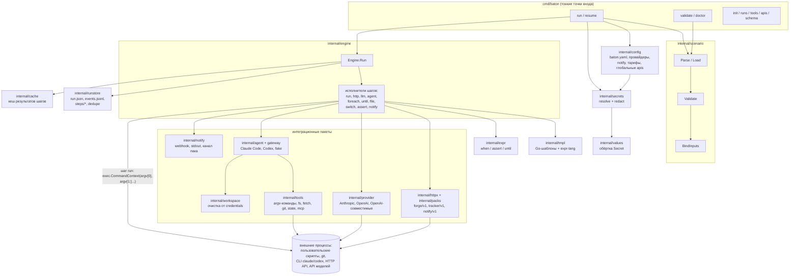
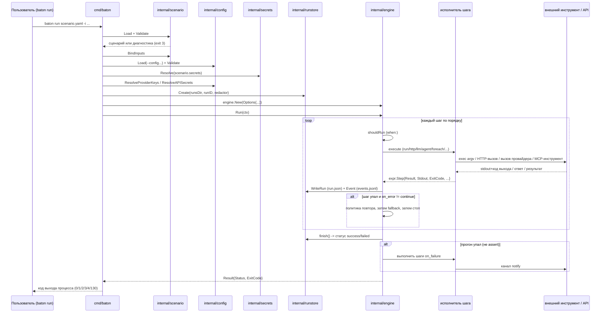

# Архитектура

Документ проецирует спецификацию ([spec.md](spec.md)) на реальные пакеты
Go: кто кого вызывает, что и куда сохраняется, где проходит граница для
конфигурации и секретов. Это карта для чтения кода, а не замена
[обзору проекта](overview.md) или ТЗ — при расхождении верны код и ТЗ.

Всё ниже описывает то, что реально делает `go build ./cmd/baton` сегодня.
Разделы про нереализованное явно об этом говорят.

## Карта компонентов



Пояснения к схеме:

- `cmd/baton` — только разбор аргументов и связывание вызовов
  (`cmd/baton/main.go`, `run.go`, `validate.go`, `doctor.go`, `resume.go`,
  `runs.go`, `tools.go`, `apis.go`, `init.go`, `schema.go`). Логики шагов
  там нет.
- `internal/scenario` не обращается ни к сети, ни к файловой системе
  сверх чтения файла сценария/схемы; единственный пакет, исполняющий
  шаги — `internal/engine`.
- В движке нет клиента FTP или SFTP — это осознанное решение по объёму
  (см. [Нет встроенного протокола передачи файлов](#нет-встроенного-протокола-передачи-файлов)).
  Шаг `run` запускает один argv-процесс (`exec.CommandContext`, сам по
  себе без shell — см.
  [Жизненный цикл выполнения](#жизненный-цикл-выполнения)), а перенос
  файла на другой хост — задача того бинаря или скрипта, на который
  указывает эта команда. Клиента S3 и подсистемы доставки/вывода в коде
  сегодня тоже нет, но это описание текущего состояния, а не решение
  никогда их не добавлять.

## Ответственность пакетов

| Пакет | Ответственность | Ключевые файлы |
|---|---|---|
| `cmd/baton` | Разбор флагов, диспетчеризация команд, коды выхода процесса | `main.go`, `run.go`, `resume.go` |
| `internal/scenario` | Парсинг YAML (`gopkg.in/yaml.v3`, `KnownFields(true)`), статическая валидация, привязка входов, JSON Schema формата | `parse.go`, `validate.go`, `inputs.go`, `schema.go` |
| `internal/config` | Глобальный `baton.yaml`: провайдеры, каналы notify, тарифы, глобальные `apis:`, глобальные секреты, MCP-серверы | `config.go`, `secrets.go` |
| `internal/secrets` | Разрешение источников секретов `env`/`file` в `values.Secret`, построение редактора | `resolve.go`, `redact.go` |
| `internal/values` | Тип-обёртка `Secret`, никогда не печатающая значение через `%v`/`String()`/`MarshalJSON` | `secret.go` |
| `internal/engine` | Исполнение одного сценария: диспетчеризация шагов, повторы, `on_error`/`on_failure`, бюджеты, контекст шаблонов/expr, учёт стоимости | `engine.go`, `run.go`, `http.go`, `llm.go`, `agent.go`, `foreach.go`, `file.go`, `cost.go` |
| `internal/tmpl` | Рендеринг Go `text/template` с набором функций сценария (`render`, `md2html`, ...) | `tmpl.go`, `markdown.go` |
| `internal/expr` | Компиляция/вычисление `when:`, `assert:`, `until.until` (expr-lang) | `expr.go` |
| `internal/httpx` | Выполнение сырых и пак-операций HTTP: схемы авторизации, пагинация, gojq-трансформы | `httpx.go`, `op.go`, `exchange.go` |
| `internal/packs` | Загрузка YAML-паков (локальная папка или закреплённый git-ref), проверка чексумм, сопоставление с `forge/v1`/`tracker/v1`/`notify/v1` | `load.go`, `source.go`, `implements.go` |
| `internal/ifaces` | Реестр интерфейсов (`forge/v1`, `tracker/v1`, `notify/v1`), которые может реализовать пак | `ifaces.go` |
| `internal/provider` | Бэкенды моделей: Anthropic, OpenAI, любой OpenAI-совместимый эндпоинт (включая OpenRouter), structured output | `anthropic.go`, `openai.go`, `compat.go`, `structured.go` |
| `internal/agent` | Интерфейс `Engine`, который исполняет шаг `agent`, и политика инструментов `Policy`, в которую превращается профиль | `engine.go`, `policy.go` |
| `internal/agent/claudecode`, `internal/agent/codex`, `internal/agent/fake` | Конкретные движки агентов | по пакету на движок |
| `internal/gateway` | MCP-сервер на loopback на один прогон с bearer-токеном; выдаёт агенту ровно те инструменты, что разрешает профиль, аудирует каждый вызов | `gateway.go`, `audit.go`, `policy.go`, `session.go` |
| `internal/tools` | Реализации инструментов за шлюзом: argv-команды, файловая система внутри workspace, `fetch` (allowlist доменов), git, межпрогонный `state`, проксирование сторонних MCP | `commands.go`, `fs.go`, `fetch.go`, `git.go`, `state.go`, `mcp.go`, `deny.go` |
| `internal/workspace` | Убирает git-креды из `.git/config` до того, как агент получит рабочую директорию | `workspace.go` |
| `internal/notify` | Разрешает и отправляет в каналы `on_failure`/`notify`: webhook, stdout или операция `notify/v1` пака | `notify.go` |
| `internal/runstore` | Владеет `runs/<id>/`: `run.json`, `events.jsonl`, `steps/<id>/*`, эффекты dedupe — всё проходит через редактор | `runstore.go`, `read.go`, `cost.go` |
| `internal/cache` | Кеш результатов шагов по контенту между прогонами | `cache.go` |
| `internal/exitcode` | Фиксированная таблица кодов выхода (`0/1/2/3/4/130`) | `exitcode.go` |

## Границы конфигурации и секретов

Прогон питают два независимых источника, разрешаемых в `execute()`
(`cmd/baton/run.go`) в таком порядке:

1. **Сценарий** (`scenario.Load` + `scenario.Validate`): шаги, `inputs:`,
   собственный блок `secrets:` сценария, `apis:`, которые сценарий может
   вызывать по имени.
2. **Глобальная конфигурация** (`config.Load`): ищется сначала в
   `~/.config/baton/config.yaml` (или `$XDG_CONFIG_HOME`), затем в
   `./baton.yaml`, затем любой `--config`/`BATON_CONFIG` — более поздние
   файлы побеждают. Несёт провайдеров, каналы notify, тарифы, глобальные
   `apis:` и глобальные секреты.

Секреты разрешаются один раз, до первого шага, и все ошибки
репортятся сразу (`secrets.Resolve`, из докстроки: "отсутствующий секрет
прерывает прогон с кодом выхода 3"):

- Секреты сценария попадают в `secrets.Store`, на который *может*
  сослаться шаблон по имени (`{{ .secrets.foo }}` внутри промпта
  отклоняется ещё на валидации — само значение до модели не доходит,
  раскрыть его может только тело шага, например HTTP-заголовок).
- Ключи API провайдеров (`cfg.ResolveProviderKeys`) и секреты глобальных
  паков (`cfg.ResolveAPISecrets`) добавляются в *тот же редактор* через
  `secretStore.WithHidden(...)`, но **недоступны по имени** из сценария —
  комментарий в `run.go`: "ключ API провайдера не должен быть читаем из
  сценария, но обязан маскироваться везде". Их использует только сам
  движок (для авторизации вызова провайдера или операции глобального
  пака).
- URL каналов notify скрываются так же (`channelURLs(channels)`) — webhook
  URL тоже считается секретом.

Всё, что покрывает редактор, маскируется в `run.json`, `events.jsonl`,
`stdout.log`/`stderr.log`/`output.json` шага и в тексте любого
уведомления — `runstore.Store` документирует, что "каждый байт, который
пишет этот пакет, сначала проходит через secrets.Redactor"
(`internal/runstore/runstore.go`).

Креды шага `run` подчиняются тому же правилу на границе процесса
(`internal/engine/run.go`, `buildEnv`/`envMap`): объявленная запись
`env:`, ссылающаяся на секрет, разрешается в открытое значение и
добавляется только в окружение дочернего процесса — "значения секретов
попадают в дочерний процесс и никуда больше: они никогда не рендерятся,
не логируются и не записываются в каталог прогона". В `input.json`
попадают только *имена* переменных окружения, никогда значения. Это
сильная мера, но не абсолютная гарантия: редактор
(`internal/secrets/redact.go`) — это буквальное сравнение строк (включая
base64 и URL-кодирование) с известными значениями секретов, применяемое к
тому, что шаг пишет в `stdout.log`/`stderr.log`. Дочерний процесс,
который преобразует секрет перед выводом (хеширует, разбивает на
несколько записей, перекодирует иначе), всё равно может незаметно занести
его в каталог прогона. Кроме того, Baton никак не изолирует дочерний
процесс: скрипт, получивший значение в окружении, волен записать его в
любое место на хосте, отправить по сети или передать другому процессу, а
равно и изменить сами учётные данные на удалённой стороне. "Секреты
попадают в дочерний процесс и никуда больше" описывает то, что с ними
делает *Baton*, а не ограничение того, что может сделать дочерний
процесс.

## Жизненный цикл выполнения



Ключевые факты, каждый привязан к коду:

- **Без shell — в раннере, но не обязательно в процессе.** Шаг `run`
  запускает `argv[0]` с `argv[1:]` напрямую через `exec.CommandContext`
  (`internal/engine/run.go:execRun`); сам Baton никогда не прогоняет
  отрендеренный аргумент через shell. Но это не мешает сценарию
  намеренно объявить `argv: ["bash", "-c", "{{ ... }}"]` (то же касается
  argv-команды шлюза в `internal/tools/commands.go`) — если в
  отрендеренную строку подставляется недоверенный контент (вывод агента,
  ответ API и т.п.), `bash -c` его проинтерпретирует. "Без shell"
  описывает поведение самого раннера, а не гарантию того, что может
  запустить `argv` сценария.
- **Код выхода решает успех.** `classifyRunError` считает ненулевой код
  выхода ошибкой класса `command`, если он не входит в
  `allow_exit_codes` шага (`internal/engine/run.go`); ошибка `command`
  идёт по той же политике `on_error`/`retry`/`fallback`, что и ошибка
  HTTP или LLM. Ошибка запуска (бинарь не найден, некорректный `cwd`)
  тоже класса `command` и никогда не повторяется.
- **Классы ошибок** (`internal/engine/errors.go`): `transient`, `schema`,
  `command`, `timeout`, `budget`, `policy`, `config`, плюс относящийся
  только к прогону `assert`. У каждого своя политика повтора по
  умолчанию; `on_error: fail | continue | fallback` задаётся на уровне
  шага.
- **Проверка идемпотентности.** Шаг повторяется автоматически, только
  если он read-only (`run.readonly: true`, read-only операция
  `http`/`file`) или несёт явный `dedupe_key` (`retryable()` в
  `engine.go`); хранилище прогона помнит, какие `dedupe_key` уже
  завершились, поэтому повтор внутри того же каталога прогона пропустит
  уже выполненный шаг. Это дедупликация по принципу best-effort, а не
  доставка ровно один раз: ключ фиксируется после эффекта, поэтому
  процесс, убитый между внешним побочным эффектом и записью ключа,
  повторит его при retry, и ничто не мешает второму эффекту от другого
  идентификатора прогона, другого `dedupe_key` или от самой вызванной
  команды.
- **Бюджеты** действуют на двух уровнях: `budget.time` оборачивает весь
  прогон в `context.WithTimeout` (`budgetContext`); бюджеты в долларах и
  токенах на шаг/вызов проверяются исполнителями `llm`/`agent` и
  отслеживаются журналом стоимости (`internal/engine/cost.go`).
- **Кеш** (`internal/cache`): результаты шага ищутся по хешу
  рендеренного входа до выполнения и сохраняются после; `--no-cache`
  отключает только чтение, не запись, поэтому прогон с промахом кеша
  всё равно заполняет кеш для следующего.
- **Resume** (`cmd/baton/resume.go` + `Options.Resume`): шаги, уже
  зафиксированные как успешные в `run.json` предыдущего прогона,
  воспроизводятся из сохранённого вывода вместо повторного выполнения;
  движок помечает их `Resumed: true` в состоянии нового прогона.
- **Сигналы**: `run.go` подключает
  `signal.NotifyContext(SIGINT, SIGTERM)`; отменённый прогон
  отображается в `exitcode.Interrupted` (130).

## Исполнители шагов и интеграции

Каждый тип шага — отдельная функция в `internal/engine`, вызываемая из
`Engine.execute` (`internal/engine/engine.go`):

| Шаг | Исполнитель | Внешняя поверхность |
|---|---|---|
| `run` | `execRun` (`run.go`) | одна argv-команда, без shell; захват stdout/stderr/кода выхода |
| `http` | `execHTTP` (`http.go`) | `internal/httpx` + загруженный пак (`internal/packs`), либо сырой запрос |
| `llm` | `execLLM` (`llm.go`) | `internal/provider` (Anthropic/OpenAI/совместимые), JSON-результат, проверенный по схеме |
| `agent` | `execAgent` (`agent.go`) | движок `internal/agent` (Claude Code, Codex, либо `fake` в тестах) через MCP-сервер `internal/gateway` |
| `foreach` | `execForeach` (`foreach.go`) | повторный вход в `executeBody` для каждого элемента, ограниченный параллелизм |
| `until` | `execUntil` | повторный вход в `executeBody` для каждой итерации, пока не выполнится условие expr-lang |
| `file` | `execFile` (`file.go`) | чтение/запись/добавление/glob, ограничено workspace |
| `switch` | диспетчеризация внутри `engine.go` | выбирает одно из нескольких тел по совпадению expr-lang |
| `assert` | `execAssert` | булева проверка expr-lang, собственный класс ошибки `assert` |
| `notify` | `execNotify` | отправка в канал `internal/notify` |

Слой HTTP/паков (`internal/httpx`, `internal/packs`, `internal/ifaces`) —
*единственная* встроенная поверхность интеграции с внешними сервисами:
пак — это YAML-документ, описывающий базовый URL, схему авторизации,
пагинацию и gojq-трансформы для одного сервиса, опционально заявляющий
один из интерфейсов `forge/v1`, `tracker/v1`, `notify/v1`, чтобы сценарий
мог вызывать `forge.*` обобщённо. Паки поставляются в `apis/` (gitlab,
github, gitea, jira, jira-server, telegram, slack), а также могут
загружаться из git-ref с закреплённым коммитом и чексуммой или
генерироваться из документа OpenAPI 3 (`baton apis import`).

Шаги `agent` получают доступ к инструментам только через
`internal/gateway` — MCP-сервер на прогон, привязанный к loopback со
случайным bearer-токеном (`internal/gateway/gateway.go`); набор
инструментов за ним (`internal/tools`) основан на возможностях, а не на
доступе: объявленные argv-команды (с валидацией аргументов,
`internal/tools/commands.go`), запись файлов, ограниченная workspace, с
deny-списком путей (`fs.go`, `deny.go`), `fetch` с allowlist доменов
(`fetch.go`), история git и локальные коммиты (`git.go`), межпрогонный
`state` (`state.go`), проксирование сторонних MCP-серверов (`mcp.go`).
Шлюз не даёт ни инструмента-shell, ни неограниченного доступа в сеть —
но это утверждение о наборе инструментов самого шлюза, а не о процессе
агента целиком. У CLI-агента вроде Claude Code или Codex есть собственные
встроенные инструменты shell и работы с файлами, которые через шлюз не
проходят; их ограничивают собственная песочница и настройки разрешений
агентского CLI (`internal/agent`, флаги и конфигурация, которые Baton
передаёт CLI), а не `internal/tools`. Шлюз — это граница для инструментов,
которые выдаёт Baton, а песочница агентского CLI — граница для всего, что
CLI умеет сам.
`internal/workspace` убирает любой credential helper git или встроенный
в URL токен из `.git/config` до того, как агент вообще увидит директорию
(`workspace.go:Prepare`).

## Нет встроенного протокола передачи файлов

В Baton **нет встроенного клиента FTP или SFTP**, и именно это —
осознанное решение по объёму функциональности, а не пробел, который
планируется закрыть позже: перенос результата прогона в другую систему
выражается шагом `run`, запускающим скрипт или специализированный бинарь
(`curl`, `rsync`, `lftp`, собственный загрузчик проекта и т.п.) — так же,
как вызывается любой другой внешний инструмент:

- Сценарий передаёт скрипту всё нужное через `argv` (уже отрендеренный)
  и `env` (для credentials — см.
  [Границы конфигурации и секретов](#границы-конфигурации-и-секретов));
  движок никогда не разбирает и не интерпретирует сам протокол.
- Движок проверяет код выхода скрипта
  (`classifyRunError`/`allow_exit_codes`); скрипт обязан сам отображать
  свой успех/неудачу в код выхода процесса — так же, как это делают
  `git`, `curl` или любая другая команда. Ненулевой код выхода, не
  входящий в список разрешённых, — это ошибка класса `command`, идущая
  по обычному пути `on_error`/`retry`/`fallback`. Чтобы Baton
  автоматически повторял такой скрипт, он тоже должен быть read-only или
  нести `dedupe_key`, как и любой другой шаг `run`.
- Учётные данные для передачи (ключ SFTP, токен S3 и т.п.) объявляются
  как секреты сценария или глобальной конфигурации и попадают в
  окружение скрипта через `buildEnv`; они никогда не подставляются в
  `argv` (это попало бы в `input.json` и в человекочитаемый лог) и
  никогда не достигают промпта шага `llm`/`agent`.
- Образ из `docker.md` поставляет `bash`, `curl`,
  `tar`/`gzip`/`bzip2`/`zip`/`unzip` именно для этого сценария
  (получение/упаковка/отправка артефактов скриптом); он не поставляет
  `rsync`, `lftp` или SDK облачных провайдеров — образ, которому это
  нужно, должен быть производным, построенным поверх базового, точно
  так же, как бинари `claude`/`codex` для шага `agent` добавляются в
  производный образ, а не в базовый.

Клиента S3 и подсистемы доставки/вывода в кодовой базе сегодня тоже нет;
в отличие от FTP/SFTP это просто текущее состояние, а не действующее
решение их не добавлять. В любом случае сейчас ничего подобного здесь нет
— не стоит предполагать их наличие при чтении сценария или написании
документации.

## Персистентность: каталог прогона

`internal/runstore` владеет `<runsDir>/<runID>/`, создаваемым один раз на
прогон (`runstore.Create`, id проверяется по
`^[A-Za-z0-9][A-Za-z0-9_-]*$`, что блокирует path traversal):

```
runs/<run-id>/
  run.json          # RunState: статус, StepState по шагам, стоимость, ошибка, resume_of
  events.jsonl       # по одному JSON-объекту на событие (ts, type, step, message, fields)
  steps/<step-id>/   # input.json, output.json, stdout.log, stderr.log на каждый шаг
```

- `run.json` пишется атомарно (временный файл + rename) после каждого
  шага, поэтому убитый процесс оставляет последнее полностью записанное
  состояние, а не частичный файл.
- Каждая запись сначала проходит через `secrets.Redactor` прогона — это
  гарантируется один раз, в `Store.redact`, а не в каждой точке вызова.
- `internal/cache` — отдельное хранилище между прогонами (по умолчанию
  рядом с `runsDir`, в `cache/`), ключ — хеш рендеренного входа шага; оно
  не часть каталога прогона и намеренно переживает прогоны.
- `baton runs list|show|logs` (`cmd/baton/runs.go` +
  `internal/runstore/read.go`) только читают этот каталог обратно, новое
  состояние не добавляют.
- `baton resume <id>` заново загружает `run.json` целевого прогона,
  воспроизводит его успешные шаги как `Options.Resume` и создаёт *новый*
  каталог прогона (с `ResumeOf`, указывающим на старый), а не изменяет
  исходный.

## Развёртывание в Docker

Полные детали: [docker.md](docker.md). Что важно для архитектуры:

- Многоэтапный `Dockerfile`: `golang:1.25.7-bookworm` собирает
  `./cmd/baton` с `CGO_ENABLED=0`; рантайм-стадия — `debian:bookworm-slim`,
  процесс работает под непривилегированным пользователем `baton`
  (uid/gid 1000).
- Набор рантайм-пакетов фиксирован и минимален: `ca-certificates`, `git`,
  `bash`, `jq`, `grep`, `ripgrep`, `curl`, `bzip2`, `zip`/`unzip`, `tar`,
  `gzip` — этого достаточно для скриптов в шагах `run` и работы с
  архивами, ничего, что подразумевало бы встроенный клиент протокола.
- В базовом образе нет тулчейна Go, Python, Node, Docker CLI и бинарей
  `claude`/`codex` — шагу `agent` или скрипту, которому нужны
  Python/Node/облачный SDK, требуется производный образ поверх этого.
- `compose.yaml` монтирует workspace в `/workspace`, запускает процесс от
  `${BATON_UID:-1000}:${BATON_GID:-1000}`, чтобы файлы, которые пишет
  baton, принадлежали хост-пользователю, и указывает `HOME` на `tmpfs`,
  монтируемый заново на каждый прогон, так как произвольный uid не имеет
  записи в passwd.
- Секреты никогда не пробрасываются неявно: `compose.yaml` не читает
  `.env` и не передаёт окружение хоста целиком; ключ провайдера или
  креды для передачи файлов задаются явно на каждый вызов через `-e`.
- `scripts/docker-smoke.sh` — собственный smoke-тест образа (запуск:
  `docker compose run --rm --entrypoint sh baton /workspace/scripts/docker-smoke.sh`):
  проверяет непривилегированный uid, все встроенные утилиты и полный
  цикл `init`/`validate`/`run` на шаблоне `hello`. Это скрипт проверки
  сборки, а не функциональность Baton.

## Проектные обсуждения vs. реализованные возможности

Чтобы документ не съезжал в домыслы, вот явная граница между тем, что
работает сегодня, и тем, что обсуждается отдельно:

| Тема | Статус | Где это описано |
|---|---|---|
| Девять типов шагов (`run`, `http`, `llm`, `agent`, `foreach`, `until`, `file`, `switch`, `assert`) + `notify` | Реализовано | `internal/engine/*.go`, см. таблицу выше |
| Паки (локальные + git, `forge/v1`/`tracker/v1`/`notify/v1`, `baton apis import/validate/call`) | Реализовано | `internal/packs`, `internal/ifaces`, `apis/` |
| MCP-шлюз и профили инструментов для шагов `agent` | Реализовано | `internal/gateway`, `internal/tools`, `internal/agent/policy.go` |
| Resume, кеш, dedupe | Реализовано | `internal/runstore`, `internal/cache`, `retryable()` в `engine.go` |
| `baton serve` / встроенный планировщик / вебхуки | **Не реализовано.** Явно названо возможным будущим в разделе "Чем Baton не является" (`overview.md`) | упоминается только в `docs/ru/overview.md` |
| Клиент FTP/SFTP | **Не реализовано и не планируется как функциональность Baton.** Перенос файлов/артефактов — это шаг `run`, вызывающий внешний скрипт или бинарь; см. [Нет встроенного протокола передачи файлов](#нет-встроенного-протокола-передачи-файлов) | решение по объёму проекта, соответствующего кода нет |
| Клиент S3, подсистема доставки/вывода | В кодовой базе сегодня отсутствует; решения ни за, ни против нет | соответствующего кода нет |

## См. также

- [Обзор проекта](overview.md) — возможности и позиционирование
- [Спецификация](spec.md) — авторитетный источник поведения, номера
  разделов, на которые ссылается этот документ
- [Справочник схемы сценария](schema.md) — все поля сценария
- [Docker](docker.md) — полный разбор сборки/запуска/секретов контейнера
- [Быстрый старт](quickstart.md) — первый прогон целиком
